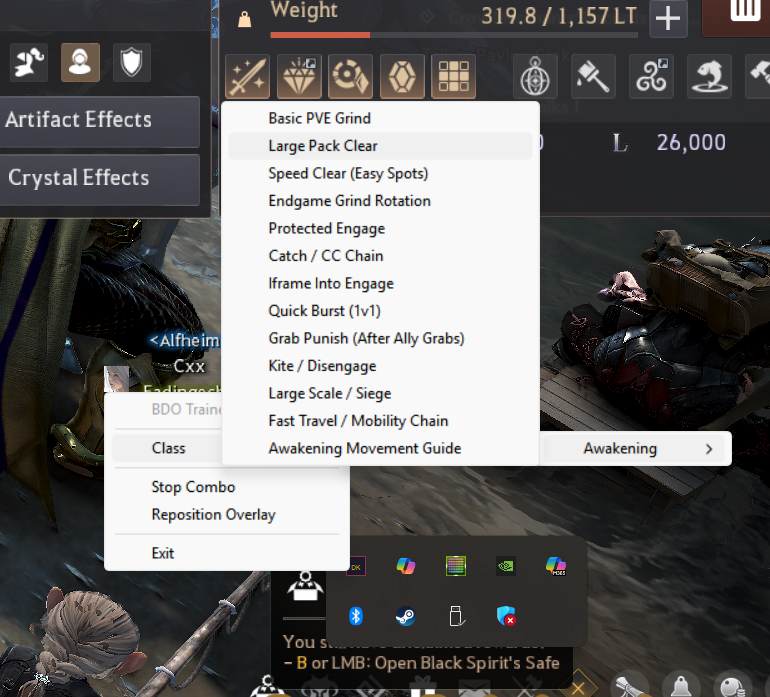

# BDO Trainer — Skill Combo Overlay

A transparent, click-through game overlay for **Black Desert Online** that displays skill combo sequences as floating outlined text over the game window. Steps advance in real time as you press the correct key and mouse combinations. Runs quietly from the system tray.

All **27 BDO classes × 2 specs (54 total)** are included out of the box — Awakening + Succession for every class, ready to go.

 


---

## Table of Contents

- [Features](#features)
- [Project Structure](#project-structure)
- [Requirements](#requirements)
- [Installation](#installation)
- [Running](#running)
- [How It Works](#how-it-works)
- [Configuration](#configuration)
  - [Global Settings — `config/combos.yaml`](#global-settings--configcombosyaml)
  - [Class/Spec Files — `config/classes/*.yaml`](#classspec-files--configclassesyaml)
  - [Combo Step Format](#combo-step-format)
  - [Key Remapping](#key-remapping)
- [Usage Guide](#usage-guide)
  - [Tray Menu](#tray-menu)
  - [Global Hotkeys](#global-hotkeys)
  - [Reposition Mode](#reposition-mode)
  - [Idle Reset](#idle-reset)
- [Adding a New Class or Spec](#adding-a-new-class-or-spec)
- [Architecture](#architecture)
- [Troubleshooting](#troubleshooting)
- [License](#license)

---

## Features

| Feature | Description |
|---|---|
| **Transparent overlay** | Fullscreen, click-through window rendered on top of BDO using Win32 `WS_EX_TRANSPARENT` + `WS_EX_LAYERED` |
| **Outlined text** | Canvas-based outlined text for readability over any background |
| **Step-by-step combos** | Each step highlights the current input; advances when the correct keys/mouse buttons are pressed |
| **Alternative keys** | Steps can define `alt_keys` so either input is accepted (e.g., `Shift + A` or `Shift + D`) |
| **Hotbar step auto-advance** | Hotbar skills can't be detected via hooks, so they auto-advance after a short delay |
| **Setup Guide** | 4-page overlay showing locked skills, hotbar setup, core skill, and skill add-ons per class/spec |
| **Settings GUI** | In-app settings editor for keybinds, display, timing, and hotkeys — no manual YAML editing needed |
| **System tray** | Pick class → spec → combo from a nested tray menu; start, stop, reposition, or exit |
| **Global hotkeys** | `F5` start/restart, `F6` stop, `F7` next Setup Guide page, `F8` reset — work even while BDO has focus |
| **Key remapping** | Remap movement keys and other bindings to match your in-game BDO keybind settings |
| **Reposition mode** | Drag the overlay text to any screen position; saved as relative coordinates in `overlay_position.json` |
| **Idle reset** | Combo automatically resets to step 1 after a configurable inactivity timeout |
| **VK fallback** | Uses virtual-key-code detection as a fallback when the game window has focus and character hooks fail |
| **Auto-discovery** | All 27 classes are pre-populated; drop additional YAML files into `config/classes/` and they appear in the tray menu automatically |

---

## Project Structure

```
bdo-trainer/
├── main.py                             # Entry point — wires everything together, auto-elevates to admin
├── requirements.txt                    # Python dependencies
├── run.bat                             # One-click launcher (installs deps + elevates + runs)
├── setup.py                            # Package setup
├── spec.md                             # Design specification
├── README.md                           # You are here
├── config/
│   ├── combos.yaml                     # Global settings (hotkeys, display, key bindings, timing)
│   ├── classes/                         # 54 files — all 27 classes × awakening + succession
│   │   ├── dark_knight_awakening.yaml
│   │   ├── dark_knight_succession.yaml
│   │   ├── warrior_awakening.yaml
│   │   ├── ...
│   │   └── woosa_succession.yaml
│   └── overlay_position.json           # Auto-generated — overlay position as relative coords
├── src/
│   ├── __init__.py
│   ├── combo_loader.py                 # Loads & merges global + per-class YAML configs
│   ├── overlay.py                      # Transparent tkinter overlay + InputMonitor (pynput hooks)
│   ├── settings_gui.py                 # Settings GUI window (keybinds, display, timing, hotkeys)
│   └── tray.py                         # System tray icon & menu via pystray
├── scripts/
│   └── download_icons.py              # Skill icon scraper
├── tests/
│   ├── __init__.py
│   └── test_basic.py
├── doc/
│   └── images/
│       ├── in-game-overlay.png         # Overlay screenshot
│       └── menu.png                    # Tray menu screenshot
├── assets/                             # Icons, images
└── logs/                               # Runtime log output
```

---

## Requirements

- **Python 3.8+**
- **Windows** (the overlay uses Win32 APIs; BDO is Windows-only)
- **Administrator privileges** (see [Why Admin?](#why-does-it-need-admin) below)

### Python Dependencies

| Package | Purpose |
|---|---|
| `pyyaml` | Parse YAML config and combo files |
| `pystray` | System tray icon and menu |
| `pillow` | Image support for the tray icon (required by pystray) |
| `keyboard` | Global hotkeys (`F5`, `F6`, `F7`, `F8`) that work over fullscreen games |
| `pynput` | Low-level keyboard and mouse listener hooks for step detection |
| `requests` | HTTP requests (used by icon scraper script) |
| `tkinter` | Overlay window (included with Python stdlib) |
| `ctypes` | Win32 API calls for click-through, elevation (included with Python stdlib) |

---

## Installation

### Option A — `pip`

```
git clone <repo-url> bdo-trainer
cd bdo-trainer
pip install -r requirements.txt
```

### Option B — `run.bat` (recommended)

Double-click `run.bat`. It will:

1. Install/update dependencies from `requirements.txt`
2. Auto-elevate to administrator
3. Launch `main.py`

No manual setup needed.

---

## Running

### From the command line

```
python main.py
```

`main.py` will auto-elevate to administrator on Windows if it isn't already running elevated. A UAC prompt will appear the first time.

### From `run.bat`

Double-click `run.bat` — it handles everything.

### What happens on launch

1. Global settings are loaded from `config/combos.yaml`.
2. All class/spec files in `config/classes/*.yaml` are auto-discovered.
3. A transparent fullscreen overlay window is created (invisible until a combo is started).
4. A system tray icon appears — right-click it to access the menu.

---

## How It Works

1. **Pick a combo** from the tray menu (or press `F5` to restart the current one).
2. The overlay displays the combo's steps as outlined text over your game.
3. The **current step** is highlighted. It shows the skill name and required input (e.g., `Shift + LMB`).
4. **Press the correct keys/mouse buttons** — the overlay detects the input via low-level hooks and advances to the next step.
5. If a step has **alternative keys** (`alt_keys`), either input combination is accepted.
6. **Hotbar steps** auto-advance after a delay since hotbar key presses correspond to slots, not specific skills, and can't be meaningfully validated.
7. When you reach the end, the combo resets to step 1 (loop).
8. If you stop pressing keys, the **idle reset timer** returns the combo to step 1 after the configured timeout.

---

## Configuration

### Global Settings — `config/combos.yaml`

This file contains global settings **only** — no skill or combo data. Example:

```yaml
# Hotkeys (work globally, even while BDO is focused)
hotkeys:
  start_restart: "F5"
  stop: "F6"
  reset: "F8"

# Display settings
display:
  font_family: "Segoe UI"
  font_size: 18
  text_color: "#FFFFFF"
  outline_color: "#000000"
  highlight_color: "#FFD700"
  outline_width: 2

# Timing
timing:
  idle_reset_timeout_ms: 5000       # Reset combo after 5 s of inactivity
  hotbar_auto_advance_ms: 800       # Auto-advance delay for hotbar steps

# Key bindings — use BDO's in-game action names
# Only remap keys you've changed from defaults
key_bindings:
  Move Forward: "W"
  Move Back: "S"
  Move Left: "A"
  Move Right: "D"
  Jump: "Space"
  Interact: "R"
  Evade: "Shift"
```

### Class/Spec Files — `config/classes/*.yaml`

Each file defines one class + spec combination. The file is auto-discovered — just place it in `config/classes/` and it will appear in the tray menu on next launch. All 27 BDO classes ship with both Awakening and Succession configs pre-populated.

Required top-level keys:

| Key | Description |
|---|---|
| `class` | Display name, e.g., `"Dark Knight"` |
| `spec` | Spec name, e.g., `"Awakening"` |

Optional top-level keys:

| Key | Description |
|---|---|
| `awakening_skills` | Map of skill definitions for the awakening kit |
| `preawakening_utility` | Map of skill definitions for pre-awakening utility skills |
| `rabam_skills` | Map of rabam/prime skill definitions |
| `pve_combos` | List of PvE combo definitions |
| `pvp_combos` | List of PvP combo definitions |
| `movement_combos` | List of movement/utility combo definitions |
| `skill_addons` | Skill addon configuration |
| `locked_skills` | List of skills to lock |
| `hotbar_skills` | List of skills placed on the hotbar |
| `core_skill` | The core/rabam skill selection |

Abbreviated example (`config/classes/dark_knight_awakening.yaml`):

```yaml
class: "Dark Knight"
spec: "Awakening"

awakening_skills:
  spirit_hunt:
    name: "Spirit Hunt"
    input: "Shift + LMB"
    keys: ["shift", "lmb"]
    damage_type: "down_attack"
    note: "Main damage skill"

  dusk:
    name: "Dusk"
    input: "Shift + A/D"
    keys: ["shift", "a"]
    keys_alt: ["shift", "d"]
    damage_type: "air_attack"

preawakening_utility:
  shadow_leap:
    name: "Shadow Leap"
    input: "Shift + Space"
    keys: ["shift", "space"]
    note: "Gap closer"

pve_combos:
  - name: "Basic Grinding Combo"
    category: "pve"
    steps:
      - skill: "spirit_hunt"
        input: "Shift + LMB"
        keys: ["shift", "lmb"]
        note: "Main damage"
      - skill: "dusk"
        input: "Shift + A/D"
        keys: ["shift", "a"]
        alt_keys: ["shift", "d"]
        note: "Follow-up"

pvp_combos:
  - name: "Catch Combo"
    category: "pvp"
    steps:
      - skill: "shadow_leap"
        input: "Shift + Space"
        keys: ["shift", "space"]
      - skill: "spirit_hunt"
        input: "Shift + LMB"
        keys: ["shift", "lmb"]
```

### Combo Step Format

Each step in a combo's `steps` list supports the following fields:

| Field | Required | Description |
|---|---|---|
| `skill` | Yes | Skill ID — must match a key in the skill definitions |
| `input` | Yes | Human-readable input string displayed in the overlay |
| `keys` | Yes | List of keys/buttons that must be pressed simultaneously |
| `alt_keys` | No | Alternative key combo that also satisfies this step |
| `note` | No | Short note displayed below the step |

**Standard step:**

```yaml
- skill: "spirit_hunt"
  input: "Shift + LMB"
  keys: ["shift", "lmb"]
  note: "Main damage"
```

**Step with alternative keys** (accepts either `Shift+A` or `Shift+D`):

```yaml
- skill: "dusk"
  input: "Shift + A/D"
  keys: ["shift", "a"]
  alt_keys: ["shift", "d"]
```

**Hotbar step** (auto-advances since hotbar presses can't be reliably detected):

```yaml
- skill: "some_hotbar_skill"
  input: "Hotbar 1"
  keys: ["hotbar"]
  note: "Press hotbar slot — auto-advances"
```

### Key Remapping

BDO lets you rebind movement and action keys. If your in-game bindings differ from the defaults, update `key_bindings` in `config/combos.yaml` using **BDO's action names**:

```yaml
key_bindings:
  Move Forward: "W"
  Move Back: "S"
  Move Left: "A"
  Move Right: "D"
  Jump: "Space"
  Evade: "Shift"
```

The combo loader translates these into the internal key names used by steps. For example, if you rebind `Move Forward` to `Up Arrow`, any combo step referencing forward movement will expect `Up Arrow` instead of `W`.

---

## Usage Guide

### Tray Menu

Right-click the system tray icon to see:



- **Class → ClassName → SpecName → Combo** — starts the selected combo on the overlay.
- **Setup Guide** — opens the 4-page setup overlay for the selected class/spec (locked skills, hotbar layout, core skill, skill add-ons).
- **Settings** — opens the Settings GUI window to edit keybinds, display, timing, and hotkeys live.
- **Stop** — stops the current combo and hides the overlay text.
- **Reposition Overlay** — toggles reposition mode (checkable menu item).
- **Exit** — shuts everything down cleanly.

### Global Hotkeys

These work globally, even when BDO is in fullscreen focus:

| Hotkey | Action |
|---|---|
| `F5` | Start the selected combo, or restart it from step 1 if already running |
| `F6` | Stop the current combo |
| `F7` | Next Setup Guide page (when the guide is active) |
| `F8` | Reset the current combo to step 1 (without stopping) |

Hotkeys are configurable in `config/combos.yaml` under the `hotkeys` section.

### Reposition Mode

1. Right-click the tray icon → select **Reposition Overlay** (a checkmark appears).
2. The overlay becomes **draggable** — click and drag the text to the desired screen position.
3. Right-click the tray icon → deselect **Reposition Overlay** to lock the position.
4. The position is saved to `config/overlay_position.json` as relative screen coordinates, so it persists across restarts and adapts to resolution changes.

### Idle Reset

If no relevant keys are pressed within the configured timeout (`idle_reset_timeout_ms` in `config/combos.yaml`, default 5000 ms), the combo automatically resets to step 1. This prevents you from getting stuck mid-combo when you take a break or switch activities.

---

## Adding a New Class or Spec

All 27 classes already ship with Awakening + Succession configs, but you can add custom variants or update existing ones.

1. Create a new YAML file in `config/classes/`. Name it descriptively, e.g., `witch_awakening.yaml` or `warrior_succession.yaml`.

2. Add the required top-level keys:

```yaml
class: "Witch"
spec: "Awakening"
```

3. Define skills:

```yaml
awakening_skills:
  voltaic_pulse:
    name: "Voltaic Pulse"
    input: "Shift + LMB"
    keys: ["shift", "lmb"]
    note: "Lightning AoE"

  equilibrium_break:
    name: "Equilibrium Break"
    input: "Shift + RMB"
    keys: ["shift", "rmb"]
```

4. Define combos using those skill IDs:

```yaml
pve_combos:
  - name: "Basic Grind"
    category: "pve"
    steps:
      - skill: "voltaic_pulse"
        input: "Shift + LMB"
        keys: ["shift", "lmb"]
      - skill: "equilibrium_break"
        input: "Shift + RMB"
        keys: ["shift", "rmb"]
```

5. Restart the application (or exit + relaunch). The new class/spec appears automatically in the tray menu under **Class → Witch → Awakening**.

No code changes required.

---

## Architecture

### Module Responsibilities

| Module | Role |
|---|---|
| `main.py` | Entry point. Checks/requests admin elevation. Instantiates the combo loader, overlay, and tray. Starts the tkinter main loop. |
| `src/combo_loader.py` | Loads `config/combos.yaml` (global settings) and auto-discovers all `config/classes/*.yaml` files. Exposes `get_class_tree()`, `get_combo()`, `get_skill_info()`, `get_key_remap()`. |
| `src/overlay.py` | Transparent, click-through tkinter fullscreen window. Renders outlined text on a canvas. Contains `InputMonitor` which sets up pynput keyboard + mouse low-level hooks. Handles reposition mode (drag-to-move, saves position). Applies key remapping. Manages the idle reset timer. |
| `src/tray.py` | System tray icon and nested menu via pystray. Dynamically builds menu from the class tree returned by the combo loader. |
| `src/settings_gui.py` | Settings window (`KeyCapturePopup` + `SettingsWindow` classes). Launched from the tray menu, edits `combos.yaml` keybinds/display/hotkeys/timing live. |
| `scripts/download_icons.py` | Skill icon scraper — downloads skill icons for all classes from BDO Codex. |

### Threading Model

```
┌──────────────────────────────────────────────────────────────┐
│  Main Thread                                                 │
│  ┌────────────────────────────────────────────────────────┐  │
│  │  tkinter mainloop                                      │  │
│  │  • Overlay rendering                                   │  │
│  │  • All UI updates via root.after() / overlay.schedule()│  │
│  └────────────────────────────────────────────────────────┘  │
├──────────────────────────────────────────────────────────────┤
│  Daemon Threads                                              │
│  ┌─────────────────┐  ┌──────────────────────────────────┐  │
│  │  pystray         │  │  pynput                          │  │
│  │  (tray icon      │  │  • Keyboard listener (daemon)    │  │
│  │   + menu)        │  │  • Mouse listener   (daemon)     │  │
│  │  (daemon thread) │  │                                  │  │
│  └─────────────────┘  └──────────────────────────────────┘  │
├──────────────────────────────────────────────────────────────┤
│  keyboard library — internal hook thread for F5/F6/F7/F8    │
└──────────────────────────────────────────────────────────────┘
```

**Cross-thread UI updates**: Any thread that needs to update the overlay calls `overlay.schedule(callback)`, which internally calls `root.after(0, callback)` to marshal the work onto the main tkinter thread. This avoids tkinter's thread-safety issues.

### Key Detection Pipeline

1. **pynput** hooks capture raw keyboard and mouse events on daemon threads.
2. Events are translated through the **key remap table** (built from `key_bindings` in settings).
3. The current pressed-key set is compared against the current step's `keys` (and `alt_keys` if present).
4. On a full match, the combo advances. A UI update is scheduled on the main thread.
5. As a **VK fallback**, when the game window has focus and character-level hooks don't fire, virtual key codes are used for detection instead.

---

## Troubleshooting

### "Keys aren't being detected while BDO is in focus"

**Cause**: BDO runs as an elevated (administrator) process. Input hooks from a non-elevated process are blocked by Windows UIPI (User Interface Privilege Isolation).

**Fix**: Make sure the trainer is running as administrator. It should auto-elevate on launch — if the UAC prompt was denied, re-run and accept it.

### The overlay doesn't appear

- Make sure a combo is selected (right-click tray → Class → pick a combo).
- Check that BDO is not running in exclusive fullscreen. Use **Fullscreen Windowed** mode in BDO's settings.
- Try pressing `F5` to start/restart the combo.

### Overlay appears but clicks go through to the game

This is **intended behavior**. The overlay is click-through by design (`WS_EX_TRANSPARENT`). The only exception is **Reposition Mode**, where clicks are captured for dragging.

### Overlay is in the wrong position

1. Right-click tray → **Reposition Overlay**.
2. Drag the text to where you want it.
3. Right-click tray → uncheck **Reposition Overlay** to lock.
4. Position is saved to `config/overlay_position.json` automatically.

To reset to center, delete `config/overlay_position.json` and restart.

### Steps aren't advancing

- Verify you're pressing the **exact combination** shown (e.g., `Shift + LMB` means hold Shift and left-click).
- Check if your BDO keybinds differ from defaults. If so, update `key_bindings` in `config/combos.yaml` (or use **Settings** from the tray menu).
- Hotbar steps auto-advance — you don't need to press anything for those.
- Check `logs/` for error output.

### Combo resets unexpectedly

The **idle reset timer** resets the combo to step 1 after a period of inactivity. Increase `idle_reset_timeout_ms` in `config/combos.yaml` if the default is too aggressive:

```yaml
timing:
  idle_reset_timeout_ms: 10000   # 10 seconds
```

### "Access denied" or permission errors

The application requires administrator privileges. See below.

### Why does it need admin?

BDO runs as an elevated process. On Windows, [User Interface Privilege Isolation (UIPI)](https://learn.microsoft.com/en-us/windows/win32/winmsg/about-hooks#uipi) prevents lower-privilege processes from installing hooks into higher-privilege processes. Without admin, keyboard and mouse hooks will silently fail to capture input when BDO has focus.

`main.py` handles this automatically — it detects whether it's elevated and re-launches itself via `ShellExecuteW` with `runas` if not.

### Tray icon doesn't appear

- Some Windows configurations hide new tray icons. Check the system tray overflow area (the `^` arrow).
- Make sure `pillow` is installed (`pip install pillow`) — pystray requires it for icon rendering.

### Adding the wrong keys / My character does something unexpected

The trainer **only displays information** — it does **not** send any keystrokes to the game. If your character is performing unexpected actions, it's not caused by this tool.

---

## License

MIT License