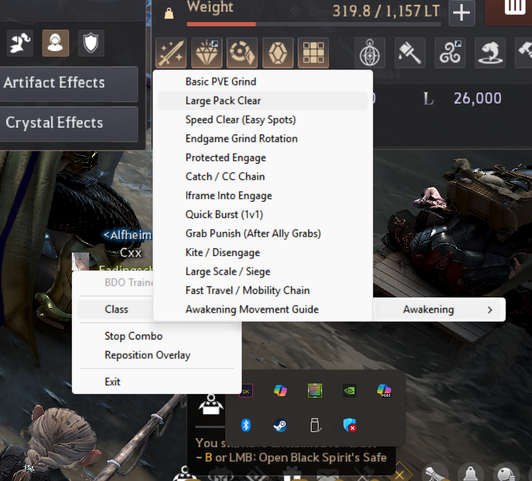

# BDO Trainer — Skill Combo Overlay

A transparent, click-through game overlay for **Black Desert Online** that displays skill combo sequences as floating outlined text over the game window. Steps advance in real time as you press the correct key and mouse combinations. Runs quietly from the system tray.

All **27 BDO classes × 2 specs (54 total)** ship with skill data.

   


---

## Table of Contents

- [Features](#features)
- [Project Structure](#project-structure)
- [Requirements](#requirements)
- [Installation](#installation)
- [Running](#running)
- [How It Works](#how-it-works)
- [Configuration](#configuration)
  - [Global Settings — `config/combos.yaml`](#global-settings--configcombosyaml)
  - [Class Definitions — `data/classes/<slug>.yaml`](#class-definitions--dataclassesslugyaml)
  - [Combo Bundles — `config/combos/<slug>/<bundle_id>/`](#combo-bundles--configcombosslugbundle_id)
  - [Combo Step Format](#combo-step-format)
  - [Key Remapping](#key-remapping)
- [Usage Guide](#usage-guide)
  - [Tray Menu](#tray-menu)
  - [Global Hotkeys](#global-hotkeys)
  - [Reposition Mode](#reposition-mode)
  - [Idle Reset](#idle-reset)
- [Overlay Animations](#overlay-animations)
- [Editors](#editors)
  - [Combo Editor](#combo-editor)
  - [Class Editor](#class-editor)
- [Bundle Files — `.bdt` and `.bdc`](#bundle-files--bdt-and-bdc)
- [Sharing a Combo on bdodojo.com](#sharing-a-combo-on-bdodojocom)
- [Adding a New Class or Bundle](#adding-a-new-class-or-bundle)
- [Architecture](#architecture)
- [macOS Support](#macos-support)
- [Migration from 0.4.x](#migration-from-04x)
- [Troubleshooting](#troubleshooting)
- [License](#license)

---

## Features

| Feature | Description |
|---|---|
| **Transparent overlay** | Fullscreen, click-through window rendered on top of BDO using Win32 `WS_EX_TRANSPARENT` + `WS_EX_LAYERED` |
| **Outlined text** | Canvas-based outlined text for readability over any background |
| **Step-by-step combos** | Each step highlights the current input; advances when the correct keys/mouse buttons are pressed |
| **Alternative keys** | Steps can define `alt_keys` so either input is accepted (e.g., `Shift + A` or `Shift + D`) |
| **Hold step progress bar** | Animated amber → gold → green fill with glow and spark effects; releasing early advances to the next step |
| **Next skill preview** | Shows the upcoming skill name + required keys below the current step; pulsates when the next step is a hold skill |
| **Slide / fade animations** | New steps slide up with ease-out (~120 ms); old content fades upward and out for smooth crossfade |
| **Setup Guide** | 4-page overlay showing locked skills, hotbar setup, core skill, and skill add-ons for the **active bundle** |
| **Settings GUI** | Tabbed window for keybinds, display, hotkeys, timing — live-reloads on save |
| **Combo Editor** | Class → bundle tree, bundle metadata + loadout panel, combo step builder. Live filter input, editable combo IDs, single-combo or whole-bundle export to `.bdt` |
| **Class Editor** | Skills tab only. Class CRUD plus `.bdc` export / import / inspect |
| **System tray** | Class → Spec → Bundle → Combo nested menu; Stop, Reposition, Setup Guide, Settings, two editor entries, Check for Updates, Exit |
| **Multiple bundles per class** | Each class/spec can host any number of named bundles, each with its own loadout (locked / hotbar / core / add-ons) |
| **Bundle import / export** | Share `.bdt` (combo bundles, gzipped JSON) or `.bdc` (class bundles, gzipped JSON) files |
| **Bundle inspector** | Read-only viewer for any `.bdt`/`.bdc` file before importing |
| **Diff preview** | "Preview Changes" button on the import flow categorises what will be added / overwritten |
| **Global hotkeys** | `F5` start/restart, `F6` stop, `F7` next guide page, `F8` reset (configurable) |
| **Key remapping** | Remap movement and ability keys to match your in-game BDO keybinds |
| **Reposition mode** | Drag the overlay text to any screen position; saved as relative coordinates |
| **Idle reset** | Combo automatically resets to step 1 after a configurable inactivity timeout |
| **Auto-migration** | Existing 0.4.x users get a transparent migration on first launch (legacy class YAMLs split into the new layout; originals archived to `config/classes/_legacy/`) |
| **Auto-updater** | Checks GitHub Releases for newer versions; opt-in config replacement with timestamped backup |
| **54 class skill libraries** | All 27 BDO classes × Awakening + Succession ship populated |
| **macOS tray-only mode** | Runs as a tray app on macOS without the overlay window (BDO doesn't run there); editor + tray remain fully functional |

---

## Project Structure

```
bdo-trainer/
├── main.py                          # Entry point — wires everything, auto-elevates admin
├── spec.md                          # Original feature spec
├── requirements.txt                 # pyyaml, pystray, pillow, keyboard, pynput
├── run.bat                          # Windows launcher (auto-elevates, installs deps)
├── run.sh                           # macOS / Linux launcher (venv, deps, permission notes)
├── setup.py                         # Package setup
│
├── data/
│   └── classes/                     # 54 class definitions — ships with the app
│       ├── dark_knight_awakening.yaml
│       ├── dark_knight_succession.yaml
│       └── ... (54 files)
│
├── config/
│   ├── combos.yaml                  # Global settings (hotkeys, key_bindings, display, timing,
│   │                                # active_bundle_per_class)
│   ├── combos/                      # User content — combo bundles
│   │   └── <class>_<spec>/
│   │       └── <bundle_id>/
│   │           ├── _bundle.yaml     # Bundle metadata + loadout
│   │           └── <combo_id>.yaml  # One file per combo
│   ├── classes/                     # 0.4.x legacy archive (auto-created during migration)
│   │   └── _legacy/
│   └── overlay_position.json        # Auto-generated — saved overlay anchor position
│
├── src/
│   ├── __init__.py                  # __version__
│   ├── combo_loader.py              # ClassLoader + BundleLoader + SettingsLoader + AppLoader facade
│   ├── input_monitor.py             # InputMonitor — keyboard + mouse via pynput
│   ├── platform.py                  # Click-through helpers, font detection
│   ├── settings_gui.py              # SettingsWindow — tabbed settings GUI
│   ├── tray.py                      # TrayManager — system tray + four-level menu
│   ├── updater.py                   # Auto-updater (GitHub Releases)
│   ├── overlay/                     # Transparent in-game overlay
│   │   ├── __init__.py
│   │   ├── core.py                  # ComboOverlay — coordinator, queue scheduler
│   │   ├── renderer.py              # OverlayContext + OverlayRenderer
│   │   ├── combo_player.py          # Playback state machine + animations
│   │   ├── hold_bar.py              # Hold-step progress bar
│   │   ├── setup_guide.py           # 4-page recommendations overlay
│   │   └── reposition.py            # Drag-to-move + persistence
│   ├── editor/
│   │   ├── __init__.py              # Re-exports ComboEditorWindow + ClassEditorWindow
│   │   ├── theme.py                 # Solarized Dark colours + force_dialog_to_front helper
│   │   ├── combo_window.py          # ComboEditorWindow + ImportComboBundleDialog
│   │   ├── class_window.py          # ClassEditorWindow
│   │   ├── combo_editor.py          # ComboEditor widget (sidebar list + step builder)
│   │   ├── skill_editor.py          # SkillEditor widget (sidebar list + skill form)
│   │   └── portability.py           # .bdt / .bdc pack/unpack/validate
│   └── utils/
│       └── keys.py                  # Key display names + outline offsets
│
├── scripts/
│   ├── seed_class_shells.py         # Idempotent: create empty class shells for any missing BDO class
│   └── migrate_class_yaml.py        # 0.4.x → 0.5.x layout migration (auto-runs on launch)
│
├── tests/
│   └── test_basic.py
├── doc/images/                      # Screenshots
├── logs/                            # Runtime logs
├── CHANGELOG.md
├── THREAD_SUMMARY.md                # Architecture snapshot + historical task records
├── README.md                        # This file
└── .gitignore
```

---

## Requirements

- **Python 3.8+**
- **Windows** for the in-game overlay (Win32 click-through APIs)
- **Administrator privileges** on Windows (BDO runs elevated; see [Why Admin?](#why-does-it-need-admin))
- **macOS** is supported as a **tray + editor only** experience (BDO doesn't run there). Linux is untested.

### Python Dependencies

| Package | Purpose |
|---|---|
| `pyyaml` | Parse YAML config / class / bundle files |
| `pystray` | System tray icon and menu |
| `pillow` | Image support for the tray icon (pystray dependency) |
| `keyboard` | Global hotkeys (`F5`–`F8`) — Windows only |
| `pynput` | Low-level keyboard + mouse listener hooks for step detection |
| `tkinter` | Overlay window + canvas + all GUIs (Python stdlib) |
| `ctypes` | Win32 click-through APIs (Python stdlib) |

---

## Installation

### Option A — `run.bat` (Windows, recommended)

Double-click `run.bat`. It will install/update dependencies, auto-elevate to administrator, and launch.

### Option B — `run.sh` (macOS / Linux)

```
chmod +x run.sh
./run.sh
```

Creates a virtual environment, installs dependencies, and launches in tray-only mode on macOS. See [macOS Support](#macos-support) for permission notes.

### Option C — `pip` manually

```
git clone https://github.com/Vitiate/bdo-trainer
cd bdo-trainer
pip install -r requirements.txt
python main.py
```

---

## Running

### From the command line

```
python main.py                # Default: full app on Windows; tray-only on macOS
python main.py --overlay      # Force the overlay window on (any platform)
python main.py --no-overlay   # Force the overlay window off (any platform)
python main.py --editor       # Editor windows only — no tray, no overlay
```

### What happens on launch

1. If `config/classes/*.yaml` is detected (the 0.4.x layout), `migrate_class_yaml.py` runs automatically — see [Migration from 0.4.x](#migration-from-04x).
2. Class definitions are loaded from `data/classes/`.
3. Combo bundles are loaded from `config/combos/<slug>/<bundle_id>/`.
4. Global settings are loaded from `config/combos.yaml`.
5. The transparent overlay window is created (suppressed on macOS by default).
6. The system tray icon appears — right-click for the menu.
7. The auto-updater checks GitHub Releases in the background.

---

## How It Works

1. **Pick a combo** from the tray menu: `Class → Spec → Bundle → Combo`. The selected `(class, spec, bundle)` becomes the **active bundle** and is persisted to `config/combos.yaml`.
2. The overlay displays the combo's steps as outlined text over your game.
3. The current step is highlighted with the skill name, protection badge, and required input.
4. **Press the correct keys/mouse buttons** — the overlay detects the input via low-level hooks and advances with a smooth slide-up animation.
5. Steps with `alt_keys` accept either input combination.
6. **Hold steps** display an animated progress bar — hold the keys for the specified duration, or release early to advance.
7. **Hotbar steps** auto-advance after a delay since hotbar key presses can't be meaningfully validated.
8. The **next-skill preview** below the current step shows what's coming up. It pulsates between grey and gold when the upcoming step is a hold skill.
9. When you reach the end, the combo loops back to step 1.
10. If you stop pressing keys, the **idle reset timer** returns the combo to step 1 after the configured timeout.

---

## Configuration

### Global Settings — `config/combos.yaml`

Global settings only — no skill or combo data lives here.

```yaml
settings:
  default_combo_window_ms: 250

  display:
    show_protection_type: true
    show_cc_type: true
    show_key_overlay: true
    highlight_protected_skills: true

  hotkeys:
    start_combo: "F5"
    stop_combo: "F6"
    next_step: "F7"
    reset_combo: "F8"

  key_bindings:                    # BDO action → physical key
    Move Forward: "w"
    Move Back: "s"
    Move Left: "a"
    Move Right: "d"
    LMB: "lmb"
    RMB: "rmb"
    MMB: "mmb"
    Sprint: "shift"
    Jump: "space"
    Q: "q"
    E: "e"
    F: "f"
    X: "x"
    Z: "z"

  timing:
    step_highlight_duration_ms: 500
    transition_delay_ms: 100
    auto_advance: false
    idle_reset_timeout_ms: 10000

  active_bundle_per_class:         # Persisted across launches
    "Dark Knight/Awakening": "default"
    "Witch/Succession": "grinding"
```

All of these can also be edited through the **Settings GUI** (right-click tray → Settings).

### Class Definitions — `data/classes/<slug>.yaml`

Class definitions ship with the app and contain **skills only**. The slug is `<class>_<spec>` lowercased with spaces replaced by underscores.

```yaml
class: Dark Knight
spec: Awakening
skills:
  spirit_hunt:
    name: Spirit Hunt
    input: W + RMB
    keys: [w, rmb]
    protection: SA
    cc: [stiffness]
    damage: high
    cooldown_ms: 3000
    description: Forward-dashing slash with super armor.
    flows_into: [shattering_darkness]
    core_effect: "Core: Spirit Hunt"
    notes: Core gap-close opener.

  shattering_darkness:
    name: Shattering Darkness
    input: SHIFT + LMB
    keys: [shift, lmb]
    protection: FG
    cc: [down_attack]
    damage: high
```

The 6 hand-curated classes (Dark Knight A/S, Witch A/S, Lahn A, Guardian A) carry the richest skill data with full descriptions and effect notes. The other 48 classes ship with seed entries you can polish through the **Class Editor** as you use them.

### Combo Bundles — `config/combos/<slug>/<bundle_id>/`

User content lives here. Each bundle is a directory containing one `_bundle.yaml` (loadout + metadata) plus one YAML per combo.

```
config/combos/dark_knight_awakening/
├── default/
│   ├── _bundle.yaml
│   ├── full_pve_chain.yaml
│   ├── awakening_main_dps.yaml
│   └── ...
└── pvp/                              # Optional second bundle
    ├── _bundle.yaml
    └── protected_engage.yaml
```

**`_bundle.yaml`** — bundle metadata + loadout:

```yaml
class: Dark Knight
spec: Awakening
bundle_id: default
name: Default
description: PVE grinding setup.
locked_skills:
  - name: Smoky Haze
    reason: Lock from skill bar to prevent misinputs during movement chains.
hotbar_skills:
  - "Flow: Spirit Blaze"
  - Shadow Strike
  - Grip of Grudge
core_skill:
  recommended: Seed of Catastrophe
  effect: Super Armor during the skill (with Core)
  reason: Adds full SA to the highest-damage nuke.
skill_addons:
  pve:
    - skill: Shattering Darkness
      addon_1: Extra AP Against Monsters +20 for 7 sec
      addon_2: Attack/Casting Speed +7% for 7 sec
```

**`<combo_id>.yaml`** — one combo per file:

```yaml
combo_id: full_pve_chain
class: Dark Knight
spec: Awakening
bundle_id: default
category: pve                        # pve | pvp | movement
name: Full PVE Chain
difficulty: intermediate
combo_window_ms: 300
description: Full grind rotation.
steps:
  - skill: spirit_hunt
    note: Engage
  - skill: shattering_darkness
  - skill: flow_bombardment
    hold_ms: 1500
    note: Hold to channel
```

### Combo Step Format

| Field | Required | Description |
|---|---|---|
| `skill` | Yes | Skill ID — must match a key in the parent class's `skills` section |
| `note` | No | Short contextual hint displayed below the step |
| `hold_ms` | No | Duration in ms for hold/channel skills (displays a progress bar) |
| `input` | No | Override the human-readable input string from the skill definition |
| `keys` | No | Override the canonical key list from the skill definition |
| `alt_keys` | No | Alternative key combo that also satisfies this step |

`input` and `keys` are normally resolved from the skill definition — only override them when a combo step uses a non-default input (e.g., a directional follow-up).

### Valid Key Names

`w`, `a`, `s`, `d`, `shift`, `ctrl`, `alt`, `space`, `tab`, `lmb`, `rmb`, `mmb`, `q`, `e`, `f`, `x`, `z`, `r`, `c`, `v`, `hold`, `hotbar`, `down`

### Key Remapping

If your in-game BDO bindings differ from defaults, edit `key_bindings` in `config/combos.yaml` (or use the **Settings GUI**). The trainer translates these into the canonical key names that combo steps use.

Example for QE-movement / AD-abilities (full swap):

```yaml
key_bindings:
  Move Left: "q"
  Move Right: "e"
  Q: "a"
  E: "d"
```

The loader will warn in the log if you've half-configured a swap (e.g., `Q: "a"` without also changing `Move Left`).

---

## Usage Guide

### Tray Menu

Right-click the system tray icon to see:



- **Class → ClassName → SpecName → BundleName → Combo** — starts the selected combo
- **Stop Combo** — stops the current combo and hides the overlay text
- **Reposition Overlay** — toggles drag-to-move mode (checkable)
- **Setup Guide** — opens the 4-page setup overlay for the active bundle
- **Settings** — opens the Settings GUI window
- **Combo Editor** — opens the combo + bundle editor
- **Class Editor** — opens the class skill editor
- **Check for Updates…** — manual auto-updater check
- **Exit** — shuts everything down cleanly

### Global Hotkeys

These work globally, even when BDO is in fullscreen focus (Windows; require `sudo` on macOS):

| Hotkey | Action |
|---|---|
| `F5` | Start the selected combo, or restart from step 1 if already running |
| `F6` | Stop the current combo |
| `F7` | Next Setup Guide page (when the guide is active) |
| `F8` | Reset the current combo to step 1 (without stopping) |

Hotkeys are configurable in `config/combos.yaml` under `settings.hotkeys`, or through the Settings GUI.

### Reposition Mode

1. Right-click the tray icon → select **Reposition Overlay** (a checkmark appears).
2. The overlay becomes **draggable** — click and drag the text to the desired screen position.
3. Right-click the tray icon → deselect **Reposition Overlay** to lock the position.
4. The position is saved to `config/overlay_position.json` as relative screen coordinates.

To reset to centre, delete `config/overlay_position.json` and restart.

### Idle Reset

If no relevant keys are pressed within the configured timeout (`idle_reset_timeout_ms`, default 10 000 ms), the combo automatically resets to step 1.

---

## Overlay Animations

### Step Layout (top to bottom)

1. **Combo name** — grey italic 14pt
2. **Skill name** — gold bold 32pt + `[PROTECTION]` badge (SA, FG, iframe)
3. **Input keys** — white 22pt
4. **Hold bar** — animated progress bar (only on hold steps)
5. **Note** — grey 14pt (optional)
6. **Step counter** — dark grey 12pt
7. **Next skill preview** — grey 14pt: `next ▸ Skill Name · Input Keys`

### Transition Animation

When the correct keypress is detected:

1. Old content is tagged and a green **✓ Skill Name** confirmation appears.
2. Old content slides upward at 3 px/frame and fades toward transparent.
3. After ~80 ms delay, the new step renders and slides up 40 px with an ease-out curve (~120 ms).
4. Once the slide completes, input is armed for the new step.

### Hold Step Progress Bar

Skills with `hold_ms` show an animated progress bar that fills **amber → gold → green** as you hold the keys, with glow and spark particle effects on the fill edge. Releasing keys early advances to the next step (no need to hold for the full duration).

### Next Skill Preview Pulse

When the upcoming step is a hold skill, the preview text pulsates between grey and gold (~1.75 s cycle) as a visual warning.

---

## Editors

### Combo Editor

Right-click tray → **Combo Editor**.

- **Sidebar tree** — class → bundles. Filter input at the top narrows by class, spec, bundle id, or bundle name.
- **Bundle metadata + loadout panel** — name, description, hotbar skills, locked skills, core skill, PVE add-ons. Each list field uses a `name :: reason` syntax for the richer entries.
- **Combo step builder** — combo ID (editable), name, category, difficulty, step window, description, and an ordered list of steps with skill dropdowns, notes, and hold timers.
- **Action buttons** — Rename Bundle, Delete Bundle, Export Combo (single combo, with parent loadout), Export Combos (whole bundle), Import Combos, Inspect.
- **Live filter** — type to narrow the bundle list to matches.
- **Editable combo IDs** — rename a combo's ID and the on-disk file is moved at the next save.

### Class Editor

Right-click tray → **Class Editor**.

- **Sidebar** — class/spec list with a live filter.
- **Skills tab** — full skill form per skill: ID, name, input string, key toggle grid (W/A/S/D, Shift/Space, LMB/RMB/MMB, Q/E/F/X/Z, Hotbar/Hold/Down), alt-keys grid, protection dropdown, damage dropdown, cooldown, level, CC checkboxes, description, notes, flows-into, core-effect.
- **+ New Class** dialog — class name + spec radio (Awakening/Succession). Auto-creates a `default` bundle so the class shows up in the tray menu immediately.
- **Delete Class** — removes the class file AND every bundle / combo for that class.
- **Action buttons** — Export Class (`.bdc`), Import Class, Inspect.

Renaming a skill ID propagates the rename through every combo's step references in every bundle.

---

## Bundle Files — `.bdt` and `.bdc`

Both formats are **gzip-compressed JSON** with a discriminator `kind` field so a single decoder handles either type.

### `.bdt` — Combo bundle (`kind = "combos"`)

Carries:

- Class + spec + bundle id + name + description
- Loadout (hotbar / locked / core / addons)
- Combos keyed by combo_id, each with steps

Used to share combo rotations between players. The Combo Editor's **Export Combo** button creates a single-combo bundle that still carries the parent's loadout for context.

### `.bdc` — Class bundle (`kind = "class"`)

Carries:

- Class + spec
- Class definition (skills only — no combos, no loadout)

Used to share full class skill libraries. The Class Editor's **Export Class** button creates one.

### v1 `.bdt` (legacy)

`.bdt` files from 0.4.x carried both class metadata and combos in a single `config` field. They still decode and route through the class importer; their combos are surfaced via the import dialog with categories backfilled.

### Inspector

Both editors have an **Inspect** button that opens any `.bdt` or `.bdc` file in a read-only viewer with Combos / Skills / Loadout tabs and missing-skill warnings — no import side effects.

---

## Sharing a Combo on bdodojo.com

A short walkthrough for taking a combo you've built in BDO Trainer and publishing it to **https://bdodojo.com** so other players can use it.

### 1. Export the combo from BDO Trainer

1. Open BDO Trainer and right-click the tray icon → **Combo Editor**.
2. In the sidebar, click the bundle that contains your combo (e.g., **Dark Knight → Awakening → default**).
3. Click the combo you want to share so it shows up in the right pane.
4. In the sidebar, click **Export Combo**.
5. Choose where to save the file. It will be saved with a `.bdt` extension — for example `dark_knight_awakening_full_pve_chain.bdt`.

That `.bdt` file is everything the site needs. It carries the combo itself plus your bundle's loadout (hotbar / locked skills / core skill / add-ons) so anyone who imports it later sees the same setup you were using.

> **Want to share a whole bundle instead of one combo?** Click **Export Combos** in the same sidebar — that produces a single `.bdt` containing every combo in the selected bundle.

### 2. Sign in to bdodojo.com

1. Go to **https://bdodojo.com**.
2. Click **Sign in** in the top-right corner.
3. Pick your preferred sign-in method: Discord, or email.

You only need to be signed in to upload or comment — other players can browse and download without an account.

### 3. Upload the `.bdt`

1. From the top navigation, click **Upload**.
2. Drag your `.bdt` file onto the upload area, or click to browse for it.
3. The site will read the bundle and show you a preview with:
   - The class and spec it's for
   - The combo name and description from the file
   - The loadout that will travel with it
   - A list of the combos inside

Take a moment to verify it parsed correctly. If anything looks off, cancel and re-export from the trainer.

> Bundles are limited to 1 MB and you can publish up to 10 bundles a day per account.

### 4. Add details before publishing

The upload page lets you polish the listing before it goes public:

- **Title** — what other players see in the feed (defaults to the combo name from your file).
- **Description** — explain what it's for: grinding spot, PVP scenario, gear assumption, anything that helps someone decide if it's right for them.
- **Tags** — pick from the suggested tags (e.g., `pve`, `grind`, `pvp`, `large-scale`) so your combo turns up in filters.
- **YouTube link** *(optional)* — add a video showing the combo in action. The site embeds it on the listing page.

### 5. Publish

Click **Publish**.

Your combo goes **live immediately** — no review queue. You'll be sent to its public page, which has a shareable URL like `https://bdodojo.com/config/abc123`.

The combo also shows up:

- In the **main feed** on the homepage
- Under **your class's browse page** (e.g., "Dark Knight → Awakening")
- Under your profile so people can find your other contributions

### How players use what you published

Anyone visiting your combo's page can click **Download `.bdt`** to grab the file, then in their own BDO Trainer:

1. **Combo Editor → Import Combos**
2. Pick the `.bdt` they downloaded
3. Choose which bundle to import it into (or create a new one)
4. Optionally also pull in your loadout

Within seconds your combo is in their tray menu, ready to run over BDO.

### Tips for a good listing

- **One combo per upload, scoped tightly.** "PVE grind — Sycraia upper" is more useful than "all my Witch combos."
- **Mention requirements.** GS or AP/DP thresholds, gear-tier assumptions, whether it relies on specific skill add-ons.
- **Note the loadout you exported with.** Other players see your hotbar / locked skills / core, but they won't know *why* without your description.
- **Add a video if you can.** Even a 30-second clip of the rotation in action makes the listing far more useful.

### If something goes wrong

- **"Couldn't read this bundle"** — the file is probably from an older version of BDO Trainer. Re-export from a 0.5.x or newer build.
- **"Daily limit reached"** — wait until tomorrow; the cap resets at UTC midnight.
- **"This file is too large"** — combos shouldn't normally come close to 1 MB. If yours does, you've probably exported a bundle full of combos rather than a single one. Use **Export Combo** for one, or trim the bundle down.
- **Need to take something down?** Delete it from your profile page, or use the **Report** button on someone else's listing if it violates the site's content rules.

---

## Adding a New Class or Bundle

### Adding a new class

1. **Class Editor → + New Class** — pick a name + spec. A `data/classes/<slug>.yaml` shell is created plus a `default` bundle so the class shows up in the tray menu immediately.
2. Use the **Skills tab** to add skill definitions.
3. Switch to the **Combo Editor** to author combos against those skills.

If BDO releases a new class, run `python -m scripts.seed_class_shells` first — it'll create empty shells for any class missing from `data/classes/`.

### Adding a new bundle

1. **Combo Editor** → click `+ New Bundle` under any class in the sidebar.
2. Enter a bundle id (lowercase, alnum / underscore).
3. Fill in the loadout fields and add combos.

### Adding a combo

1. Open the bundle in the Combo Editor.
2. Click **+ New Combo** at the bottom-left of the right pane.
3. Edit the combo ID, name, category, and steps.
4. Click **Save Bundle**.

### Importing combos from a `.bdt`

1. **Combo Editor → Import Combos** → choose a `.bdt` file.
2. Pick the target class and bundle (or create a new one).
3. Tick which combos to import. Optionally also import the bundle's loadout.
4. **Preview Changes** to see exactly what will be added / overwritten.
5. **Import**.

---

## Architecture

### Module Responsibilities

| Module | Role |
|---|---|
| `main.py` | Entry point. Auto-elevates admin (Windows). Detects + runs migration. Wires loaders, overlay, tray, hotkeys. |
| `src/combo_loader.py` | `ClassLoader` (data/classes/) + `BundleLoader` (config/combos/) + `SettingsLoader` (config/combos.yaml) + `AppLoader` facade. The legacy `ComboLoader` symbol is preserved as a compatibility shim. |
| `src/input_monitor.py` | `InputMonitor` — pynput keyboard + mouse hooks on daemon threads. Tracks pressed-key state. Applies key remapping. |
| `src/overlay/core.py` | `ComboOverlay` — coordinator that owns the tkinter root and provides a thread-safe `schedule()` queue. |
| `src/overlay/renderer.py` | `OverlayContext` (shared state) + `OverlayRenderer` (canvas-based outlined text). |
| `src/overlay/combo_player.py` | `ComboPlayer` — playback state machine, slide/fade animations, hold bar integration, next-skill preview pulse. |
| `src/overlay/hold_bar.py` | `HoldBar` — animated hold-step progress bar. |
| `src/overlay/setup_guide.py` | `SetupGuide` — 4-page recommendations overlay (reads from active bundle's loadout). |
| `src/overlay/reposition.py` | `RepositionHandler` — drag-to-move + persistence. |
| `src/tray.py` | `TrayManager` — system tray and four-level menu (class → spec → bundle → combo). |
| `src/settings_gui.py` | `SettingsWindow` — tabbed settings GUI. |
| `src/updater.py` | Auto-updater (GitHub Releases). Opt-in config replacement with timestamped backup. |
| `src/editor/combo_window.py` | `ComboEditorWindow` + `ImportComboBundleDialog` + `BundleInspectorDialog`. |
| `src/editor/class_window.py` | `ClassEditorWindow`. |
| `src/editor/combo_editor.py` | `ComboEditor` widget. |
| `src/editor/skill_editor.py` | `SkillEditor` widget. |
| `src/editor/portability.py` | `.bdt` / `.bdc` pack/unpack with v2 schema + v1 fallback. |
| `src/editor/theme.py` | Solarized Dark colours + `force_dialog_to_front` macOS helper. |
| `src/platform.py` | Click-through helpers, font detection. |
| `src/utils/keys.py` | Key display name mapping and outline offset constants. |

### Threading Model

```
┌──────────────────────────────────────────────────────────────┐
│  Main Thread                                                 │
│  ┌────────────────────────────────────────────────────────┐  │
│  │  tkinter mainloop                                      │  │
│  │  • ComboOverlay (overlay rendering)                    │  │
│  │  • SettingsWindow, ComboEditorWindow, ClassEditorWindow│  │
│  │  • All UI updates routed via overlay.schedule(...)     │  │
│  │    which uses a queue.Queue polled by root.after()     │  │
│  └────────────────────────────────────────────────────────┘  │
├──────────────────────────────────────────────────────────────┤
│  Daemon Threads                                              │
│  ┌─────────────────┐  ┌──────────────────────────────────┐   │
│  │  pystray         │  │  pynput (InputMonitor)           │   │
│  │  (TrayManager)   │  │  • Keyboard listener (daemon)    │   │
│  │  (daemon thread) │  │  • Mouse listener   (daemon)     │   │
│  └─────────────────┘  └──────────────────────────────────┘   │
├──────────────────────────────────────────────────────────────┤
│  keyboard library — internal hook thread (Windows / sudo)    │
└──────────────────────────────────────────────────────────────┘
```

**Cross-thread UI updates** go through a `queue.Queue` polled by the Tk main thread (added in 0.4.x to fix a Python 3.14 GIL crash on macOS). Foreign threads enqueue work; the main thread drains the queue every 50 ms.

### Key Detection Pipeline

1. **pynput** hooks capture raw keyboard and mouse events on daemon threads.
2. Events are translated through the **key remap table** (built from `key_bindings` in settings).
3. The current pressed-key set is compared against the current step's `keys` (and `alt_keys` if present).
4. On a full match, the combo advances. The UI update is enqueued for the main thread.
5. For **hold steps**, matching keys start the hold bar; releasing early or completing the hold advances the combo.

---

## macOS Support

macOS support is **tray + editor only** — BDO doesn't run on macOS, so the in-game overlay isn't useful there.

- **Tray-only by default** — the overlay window is suppressed unless `--overlay` is passed.
- **`keyboard` library skipped** without root (it Abort traps when its event-tap listener thread starts unprivileged). Editor + tray still work; global hotkeys do not.
- **Accessibility permissions** are required for `pynput` (granular keyboard + mouse listening). On first launch the app pops the native macOS Accessibility prompt via `AXIsProcessTrustedWithOptions`.
- **Modal dialog z-order** — extensive workarounds in place (`force_dialog_to_front`, `_ask_string` wrappers, etc.) so editor dialogs reliably stay above the parent window.
- **`--editor` flag** launches just the editor windows with no tray — handy for hands-off config editing.

Run with:

```
./run.sh                # Tray + editor (recommended)
./run.sh --editor       # Editor windows only
./run.sh --overlay      # Force the overlay on (rarely useful on macOS)
```

---

## Migration from 0.4.x

If you're upgrading from 0.4.x and have `config/classes/*.yaml` files in place, the trainer **migrates automatically on first launch**. Each old class file becomes:

- `data/classes/<slug>.yaml` (skills only)
- `config/combos/<slug>/default/_bundle.yaml` (loadout — locked / hotbar / core / addons)
- `config/combos/<slug>/default/<combo_id>.yaml` (one file per combo)

The original is moved to `config/classes/_legacy/` rather than deleted, so the migration is reversible.

To preview without writing anything:

```
python -m scripts.migrate_class_yaml --dry-run
```

---

## Troubleshooting

### "Keys aren't being detected while BDO is in focus"

**Cause**: BDO runs as an elevated process. Input hooks from a non-elevated process are blocked by Windows UIPI.

**Fix**: Ensure the trainer is running as administrator. It auto-elevates on launch — if the UAC prompt was denied, re-run and accept it.

### The overlay doesn't appear

- Make sure a combo is selected (right-click tray → Class → Spec → Bundle → Combo).
- Check that BDO is in **Fullscreen Windowed** mode — exclusive fullscreen blocks overlays.
- Try pressing `F5` to start/restart the combo.

### Overlay appears but clicks go through to the game

This is **intended behavior**. The overlay is click-through by design (`WS_EX_TRANSPARENT`). The exception is **Reposition Mode**, where clicks are captured for dragging.

### Steps aren't advancing

- Verify you're pressing the **exact combination** shown.
- Check if your BDO keybinds differ from defaults. If so, update `key_bindings` in `config/combos.yaml` (or use the Settings GUI).
- Hotbar steps auto-advance — you don't need to press anything for those.
- Check `logs/bdo_trainer.log` for error output.

### Combo resets unexpectedly

The **idle reset timer** resets the combo to step 1 after a period of inactivity. Increase `idle_reset_timeout_ms` in `config/combos.yaml`:

```yaml
settings:
  timing:
    idle_reset_timeout_ms: 30000   # 30 seconds
```

### Why does it need admin?

BDO runs as an elevated process. On Windows, [User Interface Privilege Isolation (UIPI)](https://learn.microsoft.com/en-us/windows/win32/winmsg/about-hooks#uipi) prevents lower-privilege processes from installing hooks into higher-privilege processes. `main.py` handles this automatically via `ShellExecuteW` with `runas`.

### macOS: "Editor opens but tray icon does nothing"

The `keyboard` library is intentionally skipped on macOS without root (it Abort traps the listener thread). The tray menu still works for combo selection / editor opening / settings; only the global F5–F8 hotkeys are disabled.

### macOS: Editor dialogs disappear behind the editor

This was a recurring bug fixed in 0.4.x – 0.5.x via `force_dialog_to_front` (custom dialogs) and `_ask_string` wrappers (native `simpledialog.askstring` prompts). If you still see it on a new dialog type, it's a regression — please file an issue.

### Tray icon doesn't appear

- Some Windows configurations hide new tray icons. Check the system tray overflow area (the `^` arrow).
- Make sure `pillow` is installed (`pip install pillow`).

### Adding the wrong keys / My character does something unexpected

The trainer **only displays information** — it does **not** send any keystrokes to the game. If your character is performing unexpected actions, it's not caused by this tool.

---

## License

MIT License
